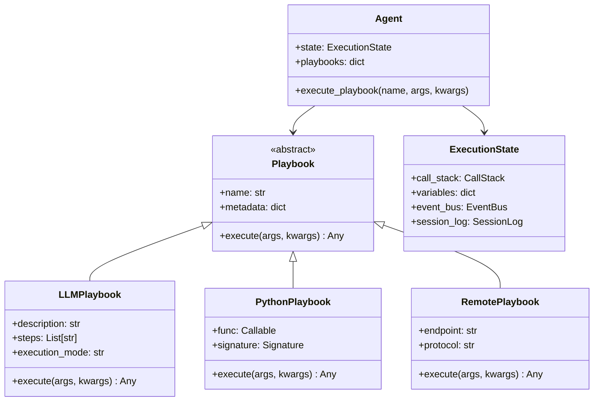

# Playbook Execution Architecture

## Core Philosophy

**Playbooks programs execute on LLMs**, just as Python programs execute on CPUs. This fundamental insight drives our architecture.

## Design Principles

- **LLM-First**: Natural language playbooks are the primary abstraction
- **Python Integration**: Python playbooks provide computational capabilities within the LLM execution model
- **Minimal Abstractions**: Only essential components, no unnecessary layers

## Core Architecture

### Base Playbook Interface

```python
class Playbook(ABC):
    """Base interface for all playbooks."""
    
    def __init__(self, name: str, metadata: dict = None):
        self.name = name
        self.metadata = metadata or {}
        self.triggers = None  # Optional triggers
    
    @abstractmethod
    async def execute(self, *args, **kwargs) -> Any:
        """Execute the playbook within the agent's execution context."""
        pass
```

### Three Playbook Types

```python
class LLMPlaybook(Playbook):
    """Natural language playbooks that execute on LLMs."""
    
    def __init__(self, name: str, description: str, steps: List[str] = None, 
                 execution_mode: str = "playbook", metadata: dict = None):
        super().__init__(name, metadata)
        self.description = description
        self.steps = steps  # Required for playbook mode
        self.execution_mode = execution_mode  # "playbook", "iterative" (ReAct loop), or "single-shot" (raw prompt)
    
    async def execute(self, *args, **kwargs) -> Any:
        # Access agent context from the call stack
        agent = self.get_current_agent()
        
        if self.execution_mode == "playbook":
            return await PlaybookLLMExecution(agent, self).execute(*args, **kwargs)
        elif self.execution_mode == "iterative":
            return await IterativeLLMExecution(agent, self).execute(*args, **kwargs)
        else:  # single-shot
            return await SingleShotLLMExecution(agent, self).execute(*args, **kwargs)


class PythonPlaybook(Playbook):
    """Python functions wrapped as playbooks for computational tasks."""
    
    def __init__(self, name: str, func: Callable, metadata: dict = None):
        super().__init__(name, metadata)
        self.func = func
        self.signature = inspect.signature(func)
    
    async def execute(self, *args, **kwargs) -> Any:
        # Python playbooks execute directly in the Python runtime
        if inspect.iscoroutinefunction(self.func):
            return await self.func(*args, **kwargs)
        else:
            return self.func(*args, **kwargs)


class RemotePlaybook(Playbook):
    """Playbooks that execute on remote systems via MCP or other protocols."""
    
    def __init__(self, name: str, endpoint: str, protocol: str = "mcp", 
                 metadata: dict = None):
        super().__init__(name, metadata)
        self.endpoint = endpoint
        self.protocol = protocol
    
    async def execute(self, *args, **kwargs) -> Any:
        # Execute via remote protocol
        transport = get_transport(self.protocol)
        return await transport.call(self.endpoint, *args, **kwargs)
```

### LLM Execution Modes

```python
class LLMExecution(ABC):
    """Base class for LLM execution strategies."""
    
    def __init__(self, agent: Agent, playbook: LLMPlaybook):
        self.agent = agent
        self.playbook = playbook
        self.state = agent.state  # Direct access to ExecutionState
    
    @abstractmethod
    async def execute(self, *args, **kwargs) -> Any:
        pass


class PlaybookLLMExecution(LLMExecution):
    """Natural language playbook execution with defined steps.
    
    This is the core playbook mode - structured natural language functions
    with explicit steps that execute on LLMs. Aligns with ### Steps sections.
    """
    
    async def execute(self, *args, **kwargs) -> Any:
        # Uses existing ExecutionState, PlaybookCall, etc.
        call = PlaybookCall(self.playbook.name, args, kwargs)
        self.state.call_stack.push(call)
        
        # Execute with compiled steps (existing logic)
        # Multiple LLM calls as it processes steps
        # This is essentially the current MarkdownPlaybookExecution
        ...


class IterativeLLMExecution(PlaybookLLMExecution):
    """Iterative execution for ReAct prompts that loops until exit conditions are met.
    
    This mode enables the LLM to repeatedly:
    - Think about the current state
    - Decide on actions (tool calls, user interaction)
    - Execute those actions
    - Check exit conditions
    - Continue or complete
    """
    
    async def execute(self, *args, **kwargs) -> Any:
        # Add iterative loop steps if not present
        if not self.playbook.steps:
            self.playbook.steps = self._create_react_loop_steps()
        
        # Delegate to playbook execution
        return await super().execute(*args, **kwargs)
    
    def _create_react_loop_steps(self) -> List[str]:
        return [
            "Think deeply about the $task to understand requirements",
            "Write down $exit_conditions for the task",
            "While $exit_conditions are not met:",
            "  - Analyze current state and progress",
            "  - Decide what action to take next",
            "  - Execute the action (tool call, user interaction, computation)",
            "  - Evaluate results against exit conditions",
            "Return final results"
        ]


class SingleShotLLMExecution(LLMExecution):
    """Single LLM call execution without loops or structure.
    
    This mode:
    - Makes ONE LLM call
    - No loops or iterations
    - No structured steps
    - Direct prompt → response
    """
    
    async def execute(self, *args, **kwargs) -> Any:
        # Simple prompt → response in a single LLM call
        call = PlaybookCall(self.playbook.name, args, kwargs)
        self.state.call_stack.push(call)
        
        prompt = self._build_prompt(*args, **kwargs)
        response = await self._get_llm_response(prompt)  # Single call
        result = self._parse_response(response)
        
        self.state.call_stack.pop()
        return result
```

## Simplified Class Hierarchy



## File Formats

### Playbooks Programs (.pb)
A `.pb` file contains a complete Playbooks program with one or more agents, each containing LLM and/or Python playbooks:

```markdown
# Assistant Agent
An AI assistant that helps with various tasks

## ResearchTopic
metadata:
  execution_mode: "iterative"  # Loops with tool calls until complete
---
Research a topic comprehensively using available tools

## QuickAnswer  
metadata:
  execution_mode: "single-shot"  # One LLM call, no loops
---
Provide a quick answer based on existing knowledge

## ProcessData
metadata:
  execution_mode: "playbook"  # Traditional structured steps
---
Process user data through defined steps

### Steps
- Validate input data format
- Transform data according to rules
- Generate output report

```python
@playbook(triggers=["when user asks about weather"])
async def get_weather(city: str) -> dict:
    """Get weather information for a city."""
    # Python code executes in Python runtime
    return await weather_api.get_current(city)
```

### MCP Servers (.py)
Standalone Python files can implement MCP servers. Their tools become RemotePlaybooks:

```python
# weather_server.py - MCP server
from mcp import Server, Tool

server = Server("weather-service")

@server.tool()
async def get_current_weather(city: str) -> dict:
    """Get current weather for a city."""
    # This becomes a RemotePlaybook when discovered
    return await fetch_weather_api(city)
```

### Remote Playbook Discovery
Remote playbooks are automatically discovered from MCP servers:

```yaml
# Auto-discovered from MCP server
name: "get_current_weather"  
endpoint: "mcp://weather-service/get_current_weather"
protocol: "mcp"
parameters:
  city: string
```

## Key Design Decisions

1. **No ExecutionContext**: You're right - ExecutionState and PlaybookCall already handle this. Playbooks can access the current agent and its state when needed.

2. **PythonPlaybook not CodePlaybook**: Python is our computational layer within the LLM execution model. Other languages would need different integration approaches.

3. **LLM-Centric Naming**: "LLMPlaybook" emphasizes that these execute on LLMs, just as programs execute on CPUs.

4. **Existing Infrastructure**: Reuse ExecutionState, CallStack, Variables, etc. - they're already well-designed.

## Migration Path

1. **Rename Classes**: 
   - MarkdownPlaybook → LLMPlaybook
   - Keep PythonPlaybook as is
   - Keep RemotePlaybook as is

2. **Simplify Execution**:
   - Move execution logic into LLMExecution classes
   - Remove unnecessary abstractions

3. **Update Compiler**:
   - Remove automatic react_steps addition
   - Support execution_mode metadata

## Benefits

- **Conceptual Clarity**: LLMs as the execution platform is front and center
- **Minimal Changes**: Reuses existing ExecutionState infrastructure
- **Clean Separation**: Python for computation, LLM for reasoning, Remote for external
- **Simple Extension**: Easy to add new LLM execution modes